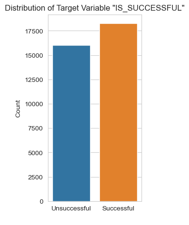
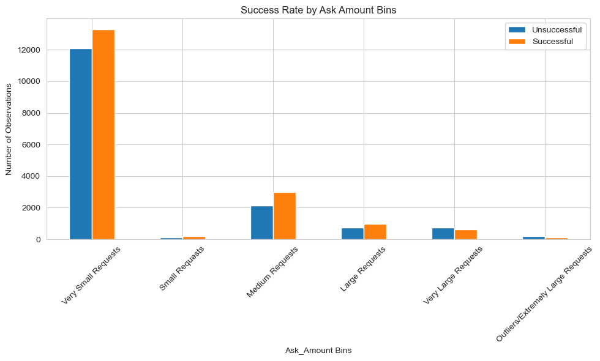
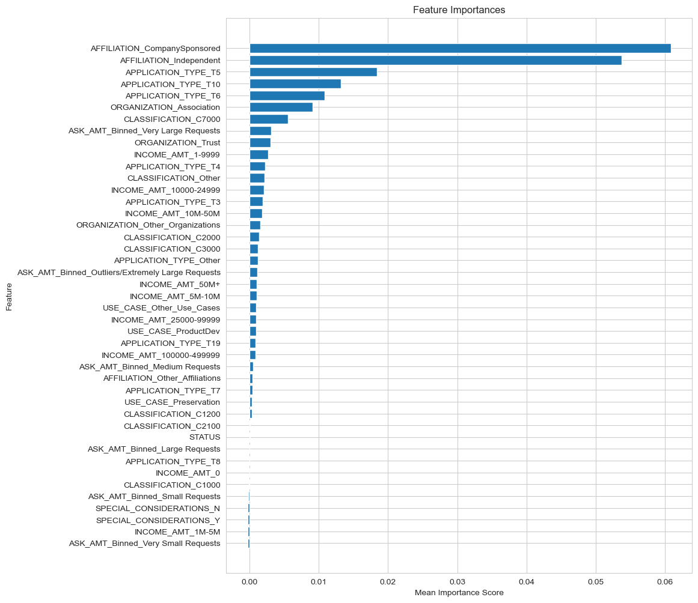

# Alphabet Soup: Binary Classification Neural Network 

## Overview:
The purpose of this analysis is to predict whether applicants will be successful if funded by Alphabet Soup.

To do this we use a binary classification neural network model. Once an initial model is built, we will aim for the model to achieve or exceed 75% accuracy after hyperparameter tuning and feature engineering. 

### Data Preprocessing:
* What variable is the Target (Dependent) Variable:
`IS_SUCCESSFUL`

*Target Variable Distribution Plot:* 

 

* Which variables are the features for the model:

*(Note: Bin numbers were experimented with a few times)*

 - `APPLICATION_TYPE` (9 Bins)  
 - `INCOME_AMT` (9 Bins)  
 - `CLASSIFICATION` (7 Bins)  
 - `ASK_AMT` (6 Bins)  
 - `USE_CASE` (4 Bins)  
 - `AFFILIATION` (3 Bins)    
 - `ORGANIZATION` (3 Bins)  

What variables should be removed from the input data because they are neither targets nor features?

 - `EIN`  
 - `NAME`  

### Compiling, Training, and Evaluating the Model:

- The initial structure served as a foundation point before experimenting with the model's architecture. One heuristic is having double the amount of neurons compared to the inputs for the first layer and then reducing the number of neurons in subsequent layers.

- The `sigmoid` activation function was applied to the output layer for all iterations. This is chosen because the sigmoid function outputs values between 0 and 1, making it ideal for binary classification. The output can be interpreted as the probability of the instance belonging to one of the two classes.

 - **Model 1** - Used relu for the activation function in both the input layer and first (and only) hidden layer as a starting point. 
 - **Model 2** - First and subsequent hidden layers were experimented with by iterating through `relu`, `leaky relu`, `tanh`, and `sigmoid`. Model 2 seemed to perform better without leaky relu as an activation option, so I eventually dropped that option.   
- `tuner.search` was used to run multiple hyperparameter options to find the best model and iterate over different neurons, layers, and activation functions. 

**Steps to try increase model performance**

 - Multiple binning options across the below categories:  

  `ASK_AMT`  
  `INCOME_AMT`  
  `APPLICATION_TYPE`  
 `ORGANIZATION`  
 `USE_CASE`
 
*Visualisation of Success Vs Ask_Amt binned Features:*

- Additional steps included exploring:      

`Feature Interactions` - The combined effect of certain features on the outcome can differ from their individual impacts. Recognizing these interactions can help in capturing complex data patterns and improving predictions.

`Regularizers` -  Prevent Overfitting: Regularization ensures the model doesn't fit too closely to the training data and can generalize well to unseen data. L1 regularization can lead some weights to become exactly zero, essentially ignoring certain input features, which can act as an automatic feature selection mechanism. L2 regularization discourages large weights. This helps in making sure the network is not too sensitive to small changes in input features.

`Permutation Importance` - A technique used to determine the importance of individual features to the model's performance. By randomly shuffling a single feature's values and measuring how much the model's performance drops, we can gauge the importance of that feature. Features that lead to a significant drop in performance when shuffled are considered important.  

 

## Summary:
| **Model Description**          | **Train Accuracy** | **Validation/Test Accuracy** |
|----------------------------|----------------|--------------------------|
| Model 1 (First Run)        | 74.28%         | 72.54%                   |
| Model 2 (Best Model iteration) | 73.16%    | 72.64%                   |  

**Model 2** performs best overall.
While its training accuracy is slightly lower than that of Model 1, its validation accuracy is marginally higher. 

A model's performance on validation data is a more reliable indicator of its ability to generalize to unseen data. Additionally, the closer training and validation accuracies are to each other, the less likely the model is overfitting. In this case, Model 2 shows a smaller gap between training and validation accuracy, suggesting it might generalize better to new data.

## Recommendation:
A recommendation for a different model could be to use an ensemble method like Random Forest. It may help with it's ability to rank feature importance and reduce overfitting. Its ensemble nature, being made up of multiple decision trees, can capture a diverse set of patterns and relationships in the data, possibly enhancing the model's predictive performance.

